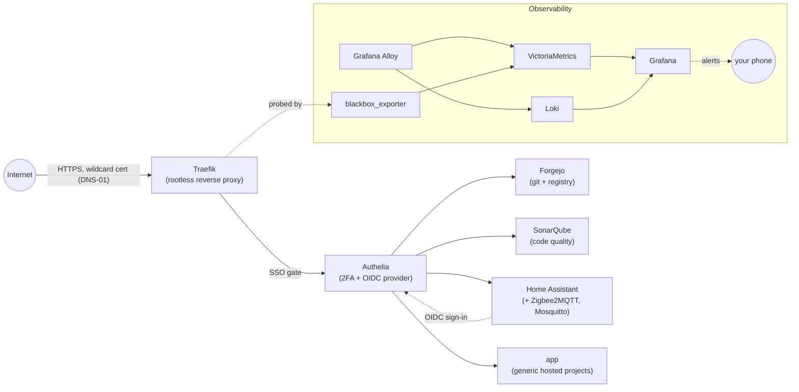

<div align="center">

# 🪐 Atlas

**A single machine, described entirely in code — a small, opinionated, self-hosted home cloud.**


</div>

## Table of contents

- [This repository](#this-repository-)
- [How to install and use it?](#how-to-install-and-use-it-)
  - [Prerequisites & runtime versions](#prerequisites--runtime-versions)
  - [Configuration variables](#configuration-variables)
  - [Local setup](#local-setup)
  - [Build, run, verify](#build-run-verify)
- [Contributing](#contributing-)
- [Contributors](#contributors-)
- [License](#license)

## This repository 📖

Atlas is a **single Debian node, described entirely in code**: one Ansible repository, no orchestrator. Full specification lives at [doc.laucoin.fr/atlas](https://doc.laucoin.fr/atlas); this repository holds only the implementation, built one role at a time against the [phased plan](https://doc.laucoin.fr/atlas/technical/implementation-plan).



### What's in the box

| Concern | Tooling |
| ------- | ------- |
| Provisioning | Ansible, run by hand from the maintainer's workstation |
| Runtime | Docker, rootless, one daemon under one service user — including the reverse proxy |
| Secrets | SOPS + `age`, per-value encryption, never decrypted at rest on the host |
| Ingress & identity | Traefik (rootless, wildcard cert via DNS-01), Authelia (SSO gate, 2FA, and — for Home Assistant only — an OpenID Connect provider) |
| Services | Forgejo (registry), SonarQube (code quality), Home Assistant + Zigbee2MQTT + Mosquitto (home automation), a generic `app` role for the maintainer's own hosted projects |
| Observability | VictoriaMetrics (metrics), Loki (logs), Grafana Alloy (collection agent), Grafana (dashboards + alerting), blackbox_exporter (endpoint + certificate monitoring) |

### Layout

```
atlas/
  inventory/            host and group variables — domain, timezone, sizes, image versions, secrets
  playbooks/
    site.yml            the everyday converge
    storage.yml         provisioning; requires an explicit confirmation variable, never shrinks
  roles/
    base/                packages, time, locale, the admin account
    hardening/           SSH, firewall, kernel settings, access control, ban rules, unattended updates
    storage/             volume assertion (site.yml) and reconciliation (storage.yml)
    docker/              the rootless runtime, the service user, identity mapping
    shell/               zsh, Starship, vim, port-inspection and volume-usage helpers
    traefik/              rootless reverse proxy, wildcard certificate via DNS-01
    authelia/              the gate — database, session store, config, users, traefik integration,
                           and an OpenID Connect provider for the one service that can't sit behind it
    theme/                 palette, error pages, the generated dashboard
    forgejo/                git hosting and the container registry
    sonarqube/               code quality, delegated sign-in via Authelia's HTTP-header trust
    homeassistant/           home automation — a Zigbee bridge on its own lifecycle, OIDC sign-in
    observability/           metrics, logs, collection agent, dashboards, alerting to the phone
    app/                     the generic hosted-application role — one declaration per project
```

Phase 3 / Services is nearly complete: `forgejo`, `sonarqube`, `homeassistant` and the generic `app` mechanism all exist; `garage` (object storage) and one real application proving `app` end-to-end are on hold pending a second physical node for Garage's own replicated layout. Phase 5 / Backup depends entirely on `garage` and hasn't started. See the [implementation plan](https://doc.laucoin.fr/atlas/technical/implementation-plan) for the full phase breakdown.

> [!IMPORTANT]
> **Nothing has been run against the real host yet.** Every phase badge above describes code and open PRs, not a converged machine.

> [!WARNING]
> **A note on the real host.** SSH reconnaissance while reconciling the `storage` role found Atlas already running a hand-built reference deployment under `/srv` — a privileged (non-rootless) `traefik`, `authentik` rather than `authelia`, TLS-ALPN-01 rather than DNS-01. Confirmed disposable, but Phase 2 stays planning-only (code written, PRs open, nothing converged) until that's resolved deliberately rather than by accident.

## How to install and use it? ⚙️

### Prerequisites & runtime versions

| Requirement | Notes |
| ----------- | ----- |
| A fresh **Debian stable** install, partitioned with **LVM** | SSH reachable; the guided partitioner's "use LVM" option creates the volume group the `storage` role expects (`vg_atlas` by default, see `roles/storage/defaults/main.yml`) — see [Local setup](#local-setup) below |
| **Ansible** on the workstation | Runs the converge; nothing is installed on the host beyond what a role declares |
| **age** on the workstation | Generates and holds the key that decrypts secrets during a converge; the key never reaches the host |
| **sops** on the workstation | Encrypts/edits per-value secrets in `inventory/**/*.sops.yaml`; decryption during a converge goes through the `community.sops` collection instead |
| **Docker** on the host | Installed and configured by the `docker` role, rootless under its own service user |
| **gh** on the workstation | Used to open the stacked pull requests described in AGENTS.md |
| A domain with a supported DNS provider | Traefik's wildcard certificate uses DNS-01 (OVH by default — see `roles/traefik/templates/compose.yml.j2` for the provider) |
| A Zigbee coordinator (USB), for `homeassistant` | A stable `/dev/serial/by-id/...` path is required — see the `homeassistant_zigbee_*` variables below |
| A Home Assistant Companion app install, for `observability` alerting | Its notify service name and a long-lived access token are needed for Grafana to reach it — both are only obtainable after Home Assistant itself is up |

### Configuration variables

Atlas has no `.env` file; configuration is inventory variables and per-value encrypted secrets.

<details>
<summary>Full variable reference (21 rows) — click to expand</summary>

| Where | Holds | Default |
| ----- | ----- | ------- |
| `inventory/hosts.yml` | The `atlas` host declaration | — |
| `inventory/host_vars/atlas/main.yml` | `ansible_host`, `ansible_user` (bootstrap connects as `root`), and three more `CHANGE_ME` placeholders real hardware/accounts fill in later: `homeassistant_zigbee_device`, `homeassistant_zigbee_adapter`, `observability_ha_notify_service` | `CHANGE_ME` / `root` / `CHANGE_ME` ×3 |
| `inventory/group_vars/all/main.yml` | `atlas_timezone`, `atlas_locale`, `atlas_admin_user`, `atlas_admin_ssh_public_key` | `Europe/Paris`, `en_US.UTF-8`, `atlas`, `CHANGE_ME` |
| `inventory/group_vars/all/images.yml` | Every container image tag this repository pins — the one file dependency updates touch | already populated; edit in place |
| `roles/storage/defaults/main.yml` | `storage_volume_group` and the managed volumes (mount, size) | `vg_atlas`; see the role for the full list |
| `roles/docker/defaults/main.yml` | `docker_service_user` and its subordinate UID/GID range | `atlas-docker`; `100000`-`165535` |
| `roles/shell/defaults/main.yml` | `shell_targets` (admin + root) and the pinned Starship version | see the role |
| `roles/traefik/defaults/main.yml` | `atlas_domain`, `atlas_acme_email`, ports, the shared proxy network's subnet and traefik's own fixed address on it | `laucoin.fr`, the maintainer's real address |
| `roles/authelia/defaults/main.yml` | `authelia_session_domain`, SMTP host/port, `authelia_users` (empty until a real account is declared) | `atlas.laucoin.fr`, `smtp.gmail.com` |
| `roles/theme/defaults/main.yml` | `atlas_palette` (light/dark), `atlas_services` (dashboard tiles for the infrastructure services already declared) | Apple's system blue; see the role |
| `roles/forgejo/defaults/main.yml` | `forgejo_ssh_port`, stack/registry paths | `2222`, `/srv/forgejo`, `/srv/registry` |
| `roles/sonarqube/defaults/main.yml` | Stack path, ports | `/srv/sonarqube` |
| `roles/homeassistant/defaults/main.yml` | Bridge/app stack paths, the pinned Home Assistant version (held below 2026.8 — see the role's own comment for why) | `/srv/homeassistant*` |
| `roles/observability/defaults/main.yml` | Retention periods (`1y` metrics, `744h` logs), `observability_probe_targets` (every route the endpoint monitor checks — add a new one here when a new route lands) | see the role |
| `roles/app/defaults/main.yml` | `atlas_apps` — one entry per hosted application (`name`, `image`, `digest`, `environment`, `database`, `storage`, `public`, `subdomain`) | `[]`, empty until a real project is declared |
| `roles/*/defaults` | Sensible per-role defaults, overridable | see each role |
| `inventory/group_vars/all/*.sops.yaml` | Secrets, encrypted per value with an age key via SOPS; auto-decrypted into normal variables during a converge | none yet created — see the full list in [Local setup](#local-setup) below |
| `.sops.yaml` | Which age key new secrets get encrypted for | `CHANGE_ME_AGE_PUBLIC_KEY` — replace before creating the first secret |
| `/srv/authelia/assets/{favicon.ico,logo.png}` | Optional Atlas branding for the sign-on portal — Authelia's only supported customisation surface, see `functional/features/unified-theme` | not created; Authelia uses its own if absent |

</details>

### Local setup

#### 1. Install Debian on the host

Install Debian stable normally, with one deliberate choice in the guided partitioner: pick **"Guided — use entire disk and set up LVM"**, and leave the volume group at its default name (or note whatever name you give it — it must match `storage_volume_group` in `roles/storage/defaults/main.yml`, `vg_atlas` by default). Enable the SSH server task during install. Nothing else is Atlas-specific yet; every package beyond a minimal base is the `base` role's job.

Confirm you can reach it: `ssh root@<its address>`.

#### 2. Install the workstation tools

- **Ansible**, then this repository's collections: `ansible-galaxy collection install -r requirements.yml`
- **age** and **sops**
- **gh**, for the stacked pull requests described in `AGENTS.md`
- A Zigbee coordinator plugged into the host, if you're converging `homeassistant` — find its stable path with `ls -l /dev/serial/by-id/` on the host.

#### 3. Point the inventory at the real machine

In `inventory/host_vars/atlas/main.yml`, replace:

- `ansible_host` — the machine's real address
- `homeassistant_zigbee_device` — the `/dev/serial/by-id/...` path from step 2
- `homeassistant_zigbee_adapter` — the coordinator's chipset (`zstack`, `ember`, `deconz`, `zigbee`, or `zboss` — check the coordinator's own documentation)
- `observability_ha_notify_service` — leave this one as `CHANGE_ME` for now; it isn't obtainable until Home Assistant itself is up (see step 8)

In `inventory/group_vars/all/main.yml`, replace `atlas_admin_ssh_public_key` with the maintainer's workstation public key.

#### 4. Set up the age key and SOPS

The `age` key that decrypts secrets stays on the workstation only; it is never copied to Atlas, and nothing is decrypted at rest on the host.

Generate it once, if it doesn't already exist: `age-keygen -o ~/.config/sops/age/keys.txt` (SOPS' own default lookup path — no environment variable needed). Copy the printed `# public key: age1...` line into `.sops.yaml`, replacing `CHANGE_ME_AGE_PUBLIC_KEY`.

#### 5. Create every secret

Each command below opens an editor on a new encrypted file; write plain YAML, save, and SOPS encrypts it in place using the recipient declared in `.sops.yaml`. Every key becomes a normal Ansible variable afterward — no `lookup()` needed anywhere, per the `community.sops.sops` vars plugin enabled in `ansible.cfg`.

| File | Keys |
| ---- | ---- |
| `inventory/group_vars/all/traefik.sops.yaml` | `ovh_application_key`, `ovh_application_secret`, `ovh_consumer_key` (DNS-01 credentials — swap for your own DNS provider's if not using OVH) |
| `inventory/group_vars/all/authelia.sops.yaml` | `authelia_jwt_secret`, `authelia_session_secret`, `authelia_storage_encryption_key`, `authelia_postgres_password`, `authelia_redis_password`, `authelia_smtp_username`, `authelia_smtp_password`, `authelia_oidc_hmac_secret` (64+ random characters), `authelia_oidc_issuer_private_key` (a PEM-encoded RSA private key, 2048-bit minimum — needed for Home Assistant's OIDC sign-in) |
| `inventory/group_vars/all/forgejo.sops.yaml` | `forgejo_postgres_password`, `forgejo_secret_key`, `forgejo_internal_token` |
| `inventory/group_vars/all/sonarqube.sops.yaml` | `sonarqube_postgres_password` |
| `inventory/group_vars/all/observability.sops.yaml` | `observability_grafana_admin_password`, `observability_ha_long_lived_token` (see step 8 — this one has to wait) |

A declared `app` entry that requests a database holds its own `postgres_password` inline in its own `atlas_apps` list entry rather than a separate file — SOPS encrypts per value regardless of nesting.

#### 6. Provision storage

Storage is provisioned once, separately from the everyday converge, and never shrinks:

```bash
ansible-playbook playbooks/storage.yml --check --diff
ansible-playbook playbooks/storage.yml -e storage_confirm=true
```

#### 7. Converge everything else

See [Build, run, verify](#build-run-verify) below.

#### 8. Finish the two things a converge can't do

Two short, one-time manual steps remain after the first converge — both are UI-only in current Home Assistant, with no documented non-interactive equivalent:

1. Open `https://homeassistant.atlas.<your domain>/`, complete onboarding (home location, the local recovery account's password), then add the MQTT integration (**Settings → Devices & Services → Add Integration → MQTT**, broker `mosquitto`, port `1883`, no credentials) so Zigbee devices bridged by Zigbee2MQTT actually appear.
2. Install the Home Assistant Companion app, sign in, then find its notify service name (**Settings → Devices & Services**, your phone's entry, or **Developer Tools → Actions**, search "notify") and generate a long-lived access token (**your profile → Security → Long-lived access tokens**). Put the service name in `observability_ha_notify_service` and the token in `observability_ha_long_lived_token` (step 3 and step 5), then converge once more so Grafana's alerts can actually reach your phone.

### Build, run, verify

There is no automated test suite, by choice — idempotency is enforced by how roles are written (see `technical/ansible-conventions`), and a clean second converge is the proof. Storage must already be provisioned (step 6 above) — `site.yml` only asserts it exists at the declared size; it never creates or resizes anything.

```bash
ansible-playbook playbooks/site.yml --check --diff   # review first, always
ansible-playbook playbooks/site.yml                  # apply
ansible-playbook playbooks/site.yml                  # re-run immediately: must report zero changes
ansible-playbook playbooks/site.yml --tags theme      # converge one role only
```

## Contributing 💻

TODO

## Contributors 🧑‍💻

TODO (all contributor)

## License

Distributed under the MIT License. See [`LICENSE`](./LICENSE) for details.
